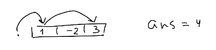

# I.1 Dynamic programming

## Решение задачи с помощью ДП

* `dp[l][r] - min стоимость решения задачи на [l, r], т.е. то, что храним в dp`
* `формула пересчета - переход к большим отрезкам через меньшие`
* `порядок пересчета: перебираем отрезки в порядке возрастания длин, тогда ответ для больших отрезков выражается через ответ для меньших`
* `база динамики`
* `ответ на запрос`

## Примеры задач

### 1. Задача о кузнечике

_Дано_: полоска из n клеток с числами: `a1, a2, ..., an`. Левее  a1 \(далее, в позиции 0\) стоит кузнечик, который может прыгать либо на одну клетку вправо, либо делает прыжок через одну клетку вправо. Стоимость перемещения: `a_i` , в которое попадаем.

_Задача_: путь из начального положения в `an` с максимальной суммарной стоимостью.



Пусть dp\[i\] - max стоимость пути из 0 в i. Задача та же, только прыгаем до i-й ячейки. В i-ю клетку могли прийти либо из i-1, либо из i-2. Тогда:

`dp[i] = a[i] + max(dp[ii-1], dp[i-2])` , база: `dp[0] = 0`, `dp[1] = a[1]`

_Ответ:_ `dp[n]`

 Пересчет:

```text
for i = 2...n:
    dp[i] = a[i] + max(dp[ii-1], dp[i-2])
```

_Замечание: жадный алгоритм не работает_ 


### 2. Задача о черепашке

_Дано_: двумерная таблица с числами размера n x m, нужно попасть из левого верхнего угла в нижний, можно:

* ходить на одну клетку вправо
* на одну вниз
* по диагонали вниз-влево на две клетки

Ищем min стоимость пути.

`dp[i][j] - min стоимость пути из (1,1) -> (i,j)`

 Ответ: `dp[n][m]`

Пересчет:

```text
dp[i][j] = a[i][j] + min(dp[i-1][j], dp[i][j-1], dp[i-2][j-2])
```

Или же, при i,j &lt; 3 каких-то значений не будет в функции min.

Порядок пересчета:

```text
for i = 1,...,n:
    for j = 1,...,m:
        dp[i][j] = a[i][j] + .... (см наверх)
```

База: `dp[1][1] = a[1][1]` 

Замечание: сверху рассмотрели ДП  "слева-направо, назад" - т.е. выражали через предыдущее. 

Вариант ДП "вперед" - \[i\]\[j\] оптимальные, просчитываем след. ходы:

```text
dp[...][...] = +inf // заполнили все ДП нулями
d[1][1] = a[1][1]

// далее из каждой клетки "идем вперед" - перебираем
// продолжение текущего пути

for i = 1,...,n:
    for j = 1,...,m:
        // просчитываем вниз
        if (i + 1 <= n): dp[i+1][j] =
          min(dp[i+1][j], a[i+1][j] + dp[i][j])
        // просчитываем направо
        if (j + 1 <= m): dp[i][j+1] =
          min(dp[i][j+1], a[i][j+1] + dp[i][j])
        // диагональ
        if (i + 2 <= n and j + 2 <=m):
          // аналогично, но в dp[i+2][j+2]
```

### 3. Задача о НОП \(наиб. общей подпослед-ти\)

Есть две строки \(или массива\) s и t, нужно найти их НОП. Это посл-ть, полученная вычеркиванием некот-х элементов, допустим, из s - новая строка. Можно ли такую же найти в t?

Задача: найти наибольщую по длине общую подпосл-ть.

`dpi[i][j] - длина НОП  на префиксах s[1...i] и t[1...j]`

 `dp[0][j] = 0, dp[i][0] = 0 для всех i, j`

 Пересчет: см на [neerc.ifmo](https://neerc.ifmo.ru/wiki/index.php?title=%D0%97%D0%B0%D0%B4%D0%B0%D1%87%D0%B0_%D0%BE_%D0%BD%D0%B0%D0%B8%D0%B1%D0%BE%D0%BB%D1%8C%D1%88%D0%B5%D0%B9_%D0%BE%D0%B1%D1%89%D0%B5%D0%B9_%D0%BF%D0%BE%D0%B4%D0%BF%D0%BE%D1%81%D0%BB%D0%B5%D0%B4%D0%BE%D0%B2%D0%B0%D1%82%D0%B5%D0%BB%D1%8C%D0%BD%D0%BE%D1%81%D1%82%D0%B8)

```text
(1) if s_i != t_j:
    dp[i][j] = max(dp[i-1][j], dp[i][j-1]
(2) elif s_i == t_j:
    dp[i]][j] = 1 + dp[i-1][j-1]
(3) elif i == 0 or j == 0:
    dp[i][j] = 0
```

Асимптотика: `O(nm); n,m - длины s,t`

### 4. Задача о НВП \(наиб. возраст-я подпосл-ть\)

Дано: `a1,...,a_n` - массив чисел, нужно найти максимальную длину такой подпосл-ти. 

#### 1 способ `O(n^2)`

Пусть dp\[i\] - длина НВП, которая оканчивается в a\[i\] \(a\[i\] входит\)

Рассм. последний шаг: до a\[j\] __смотрим все a\[i\], что i &lt; j и a_i &lt; a_j

`dp[j] = max{i<j, a[i] < a[j]}(1, 1 + dp[i])`

Таким методом выбираем предпоследний элемент - максимизируем длину на префиксе от 1 до i.


```text
for j = 1,...,n:
    for (i < j, a[i] < a[j]):
        dp[j] = ....
```

#### 2 способ  с помощью ДО`O(nlong)`

Все элементы инактивны, активируем их в порядке возрастания a\[i\] \(при равенстве a\[i\] = a\[j\] раньше тот, кто правее \(i &gt; j\)\)

`sorted = {(a[i], i)}`

Сначала оживляем 1-ю порядковую статистику, далее 2-ю, 3-ю, ... .К моменту оживления a\[i\] все живые элементы левее i - в точности все числа, меньшие a\[i\].

Строим ДО с операциями max на префиксе и изменение в точке \(увеличение в точке\).

В вершине ДО храним max среди dp\[k\] по k из контролируемого подотрезка.

Идем по sorted, `dp[i] = max(1, 1 + get(1, i-1))` , где get - получить max на отрезке\[1, i-1\] среди всех живых левее i.

`dp[i] <- update(i)` - обновляем в точке в ДО

**Пример:**


![dp\[3\] = 3](../.gitbook/assets/image%20%285%29.png)


Ответ: `max(dp[1], dp[2], ..., dp[n])`

#### **3** способ  с помощью ДО`O(nlong)`

`to be continued...`

### **5. Задача о чем?**

