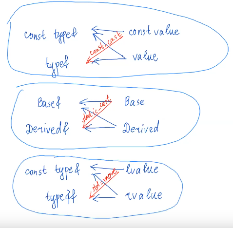
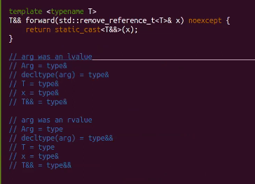

# 11.1 Move semantics

#### 24. Rvalue-ссылки, универсальные ссылки. Реализация std::move, std::forward

### 11.4 Rvalue and lvalue expression

type&& - rvalue reference, type& - lvalue reference

lvalue:

* identifiers \(имя переменной\)
* =, +=, \*=, /=, %= on primitive types
* prefix ++, -- on primitive types
* unary \*
* result of ? : if both are lvalue
* result of "," if rhs-value is lvalue \(right hand side\)
* result of function call \(or method, or custom operator call, if return type is lvalue-ref\)
* result of cast-expression, if return type is lvalue-ref

rvalue::prvalue \(pure rvalue\)

* literals \(значения: 5, 3.0f\)
* binary: +, -, \*, /, % etc on primitive types
* postfix ++, --
* unary &, +, -
* result of ? : if at least one of operand is rvalue
  * true ? ++x : x++ = 1
* result of "," if rhs-value is rvalue
  * \(x, 5\) = 1 // CE
* result of function call \(or method, or custom operator call, if return type is not ref\)
* result of cast-expression, if return type is not a reference

rvalue::xvalue \(expired value\)

* return of function call \(or method, or custom operator\), if return type is rvalue-ref
* result of cast-expression, if return type is rvalie-ref
* return of ?; in some cases
* result of {".", ",", "-&gt;"} in some cases

### 11.5 Rvalue references and rules of their init

обычные ссылки инициализируются от lvalue

```text
 int main() {
     int x = 0;
     int& rx = x; // int& rx = 1; CE
     const int& crx = 2;
     
     // int&& rrx = x; // CE
     int&& rrx = 0;
     rrx = x; // все ок, это не инициализации
     
     int& rx = rrx; // rrx is lvalue (identifier)
     const int& rx = rrx;
     
     int&& rrx2 = rrx; // CE, rrx is lvalue
     
     // Rvalue reference on existing object - std::move
     int&& rrx2 = std::move(rx);
 }
```



### 11.6 Universal references and reference collapsing

```text
 f(const type& x) <- both lvalue and rvalue, but const
 f(type& x) <- only lvalue
 f(type&& x) <- only rvalue
```

Как функциям принимать как константные, так и неконстантные r\(l\)value?

```text
 template <typename T>
 void f(T&& x) {
     // universal reference
 }
 ​
 int main() {
     f(5); // T = int
           // decltype(x) = int&&
     
     int y = 5;
     f(y); // T = int&
           // decltype(x) = int&
 }
 ​
 // работает непосредственно с шаблонным параметром функции
```

Reference collapsing:

* & + & = &
* & + && = && + & = &
* && + && = &&

Универсальные ссылки предпочтительнее любых других при перегрузке

### 11.7 std::move implementation

```text
 template<typename T>
 std::remove_reference_t<T>&& move(T&& x) noexcept { // убрать амперсанд (иначе ref collaps)
     return static_cast<std::remove_reference_t<T>&&>(x);
 }
```

### 11.8 Perfect forwarding problem, std::forward

```text
 template <typename... Args>
 void emplace_back(const Args&... args) {
     ...
 }
 // переменные могут быть как rvalue, так и lvalue
 ​
 template <typename... Args> // reference collapsing
 void emplace_back(Args&&... args) { // Universal ref
     AllocTraits::construct(alloc, arr + sz, std::forward<Args>(args)...);
 }
 // переменные могут быть как rvalue, так и lvalue
```

```text
 template <typename T>
 T&& forward(std::remove_reference<T>& x) noexcept {
     return static_cast<T&&>(x);
 }
```



