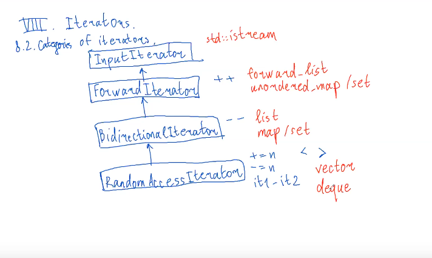

# VIII.1 Iterators

### 8.1 Basic idea and syntax

Сущности, которые позволяют перечислять элементы некоторой последовательности.

Итератор - то, что ведет себя как итератор. Т.е. позволять себя разыменовывать, инкрементировать, сравнивать на равенство.

```cpp
#include <vector>
#include <list> // двусвязный список

int main() {
    std::vector<int> v = {1, 2, 3, 4, 5};
    v.end(); // указатель на "элемент" за последним элементом, свидетельствует о конце контейнера
    for (std::vector<int>::iterator it = v.begin(); it != v.end(); ++it) {
        std::cout << *it; // все, что лежит в векторе
    }
    // начальный элемент вектора
    // можно и для list, даже если к структуре нельзя обращаться с помощью []
    
    for (int x: v) { // range based for
        std::cout << x << ' ';
    } // перебор элементов контейнера и не только
}
```

### 8.2 Categories of iterators





* однонаправленные - **forward iterators**
* двунаправленные - **bidirectional iterators** - назад и вперед быстро на один шаг - частный случай forward
* с произвольным доступом \(random access\) - шаги на произвольную сторону - частный случай bidirectional

std::istream::iterator - input iterator - пройтись только один раз в одну сторону \(не можем скопировать и пройти второй раз\)

```cpp
#include <map>
int main() {
    std::map<int,int> m;
    m[3] = 5;
    m[5] = 4;
    m[9] = 8;
    
    std::map<int,int>::iterator it1 = m.find(3);
    std::map<int,int>::iterator it2 = m.find(5);
    
    if (it1 < it2) // CE
    it1 += 1; // CE
    
}
```

